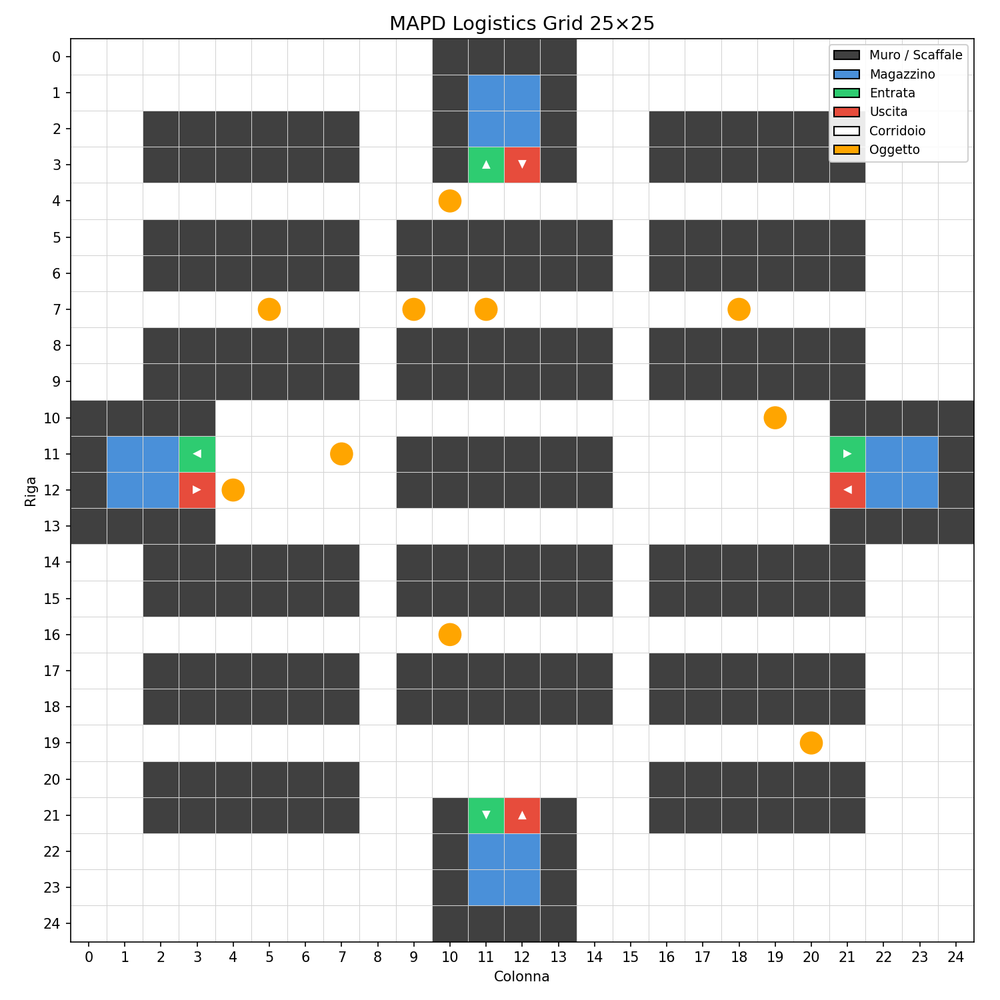

# MAPD Logistics Grid: Multi-Agent System for Object Recovery

## Project Overview
The **MAPD Logistics Grid** is a Multi-Agent System (MAS) simulation designed to coordinate a fleet of autonomous agents tasked with locating and recovering objects scattered across a logistics environment. The agents must explore the grid, detect hidden objects, and transport them to designated warehouses.

<p align="center">
  
</p>

While the map structure (walls, corridors, and warehouses) is known initially, the specific locations of the objects are hidden. Agents must use their sensors to "discover" these items through active exploration.

### Core Objectives (Goals)
The system aims to optimize three key performance indicators:
1) **Success Rate**: Maximize the number of objects successfully detected and delivered.
2) **Time Efficiency**: Minimize the total time (ticks) required for the recovery operation.
3) **Energy Efficiency**: Minimize the average energy consumption across the agent fleet.

---

## Environment Characteristics
The simulation takes place on a 2D grid composed of several cell types:
*   **Transit Zones**: Open corridors and yards for movement.
*   **Warehouses**: Specific zones for delivery, featuring dedicated **Entry** and **Exit** points.
*   **Obstacles**: Static walls and shelves that block movement and vision.
*   **Objects**: Target items located at specific coordinates (Ground Truth).

Obstacles and warehouses are static. Agents lack global knowledge of object positions and must rely on their local perception.

---

## Agent Specifications
Each agent starts at the top-left coordinate `[0,0]` and is equipped with:
*   **Position Tracking**: Current grid coordinates.
*   **Visibility Sensors**: 
    *   Configurable perception range (Manhattan distance).
    *   Obstacle and object detection.
    *   Line-of-Sight (LoS) logic: Vision is occluded by walls.
    *   Warehouse entrance/exit recognition.
*   **Energy Management**: Limited battery (typically 500 units). Every move costs 1 unit.
*   **Local Memory**: A persistent map built by the agent as it explores the grid.
*   **Communication Sensor**: Detects nearby agents to share information.
*   **Decision-Making Engine**: Autonomous strategy selection (e.g., Frontier-based exploration vs. pathfinding to known targets).

*Note: In this implementation, agent overlapping is permitted to simplify the coordination logic.*

---

## Communication Logic
Agents share knowledge through an intersection of their communication ranges. When two or more agents are close enough:
1) They **merge their local maps**, filling in each other's "blind spots."
2) They **exchange known object locations**, allowing an agent to head towards a target discovered by another.

---

## Simulation Mechanics
*   **Tick System**: The simulation time advances by +1 whenever a single agent executes a move.
*   **Round-Robin Execution**: Agents act sequentially. In a fleet of 5, one full cycle of moves equals 5 global ticks.
*   **Termination**: The simulation ends when all objects are delivered, all agents run out of battery, or the maximum tick limit is reached.

## Getting Started
### Prerequisites
*   Python 3.x
*   Numpy

### Installation
1. Activate your virtual environment: `.\.venv\bin\Activate.ps1`
2. Install dependencies: `pip install numpy`

### Running the Simulation
Execute the main script:
```bash
python main.py
```
The simulation will generate a `log_A.json` file containing the step-by-step state for later analysis and visualization.
